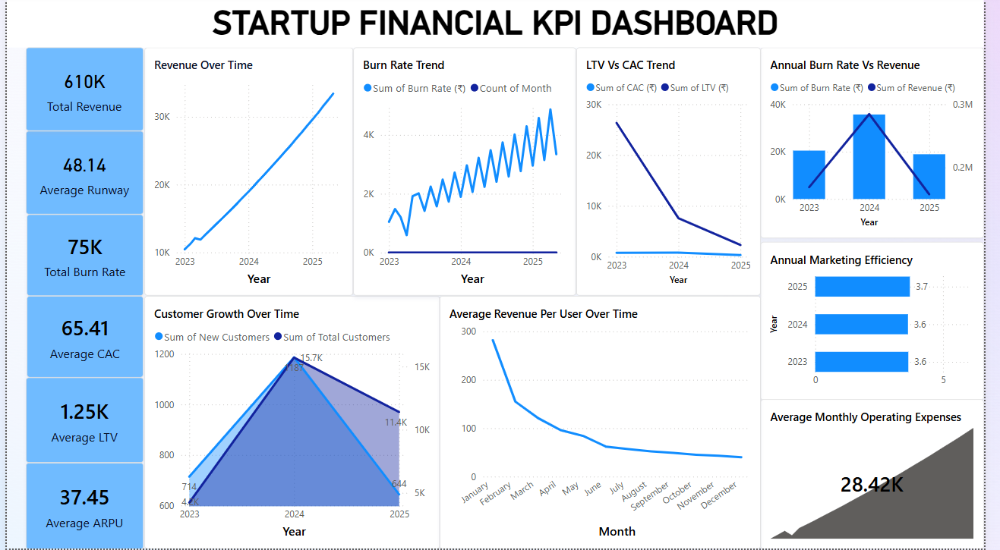

# 📊 Financial KPI Analysis for a Startup

## 🔍 Objective
Analyze core financial metrics for an early-stage startup to monitor health and growth. This includes tracking monthly revenue, burn rate, CAC, LTV, and run rate.

## 🛠️ Tools Used
- **Excel** – Initial financial data processing
- **Python (Pandas)** – Data cleaning, analysis, and visualizations
- **Power BI** – Optional visual dashboard (`KPI_Dashboard.pbix`)

## 📌 Mini Guide
1. **Data Collection**
   - Monthly financials including revenue, expenses, and customer acquisition data.
2. **Key Metric Calculations**
   - Compute KPIs: LTV (Lifetime Value), CAC (Customer Acquisition Cost), Run Rate, Burn Rate.
   - Calculate LTV:CAC Ratio to assess financial efficiency.
3. **Cohort Analysis**
   - Analyze user behavior and spending based on monthly customer sign-up cohorts.
4. **Visualization**
   - Dashboards built in Tableau and Power BI.
   - Python notebook includes KPI trend visualizations and summary stats.

## 📁 Deliverables
- `KPI_Dashboard.pbix`: Power BI Dashboard for KPI tracking
- `startup_financials_dataset.xlsx`: Raw financial data
- `visualizations.ipynb`: Python notebook for metric analysis and graphs
- **Coming Soon**: `LTV_vs_CAC_Report.pdf`: A business report summarizing LTV:CAC findings

## 📸 Sample Dashboard Preview

### 🚀 How to Use
1. Clone the repository.
2. Open the `.ipynb` file in Jupyter Notebook to run the Python analysis.
3. Open `KPI_Dashboard.pbix` in Power BI or the Tableau file (if uploaded) for visual exploration.

---

### 🧠 Author
Shreevani Soma  
For academic and professional use  
